# Insertion Sort Lab

An interactive visualization tool that demonstrates the insertion sort algorithm with step-by-step execution tracking, performance metrics, and algorithm comparisons.

## Screenshots & Testing Evidence

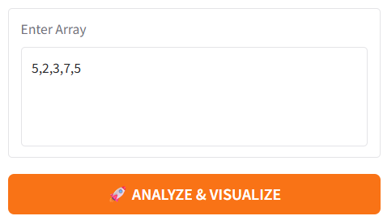


*Figure 1: Random input test - demonstrates sorting of mixed numbers*

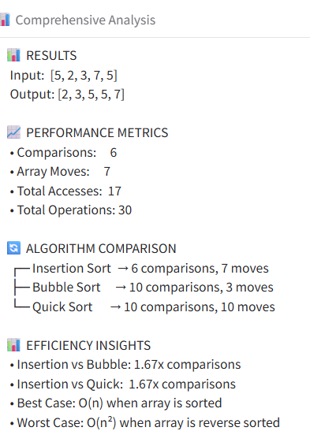


*Figure 2: Performance analysis showing comparisons, moves, and algorithm comparison*

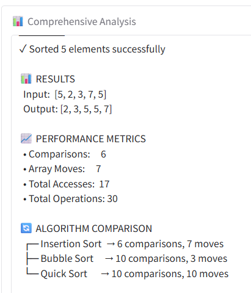


*Figure 17: Alternate analysis capture for random input*

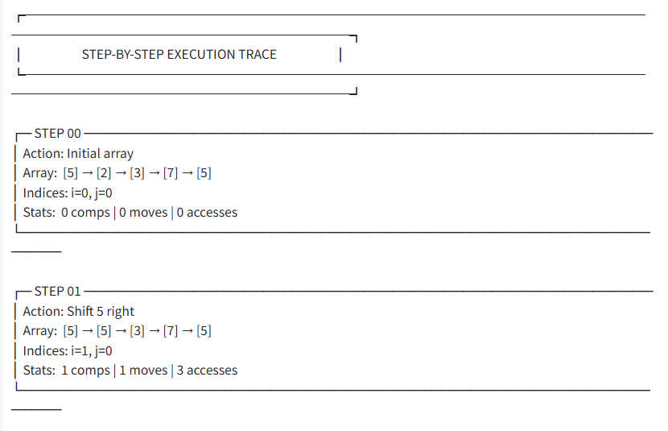


*Figure 3: Step-by-step trace showing algorithm execution*

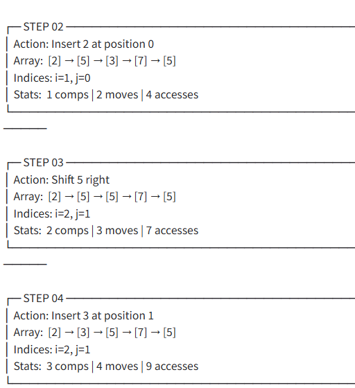


*Figure 4: Continued step-by-step execution with indices and metrics*

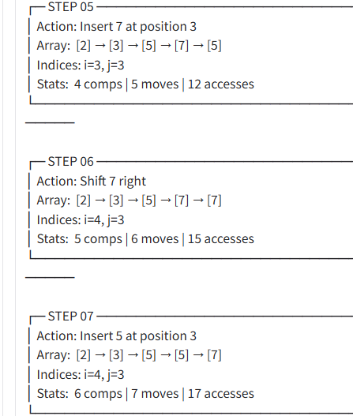


*Figure 5: Final steps showing sorted result*

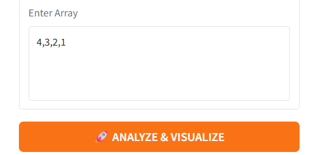


*Figure 6: Worst-case test - reverse sorted input*

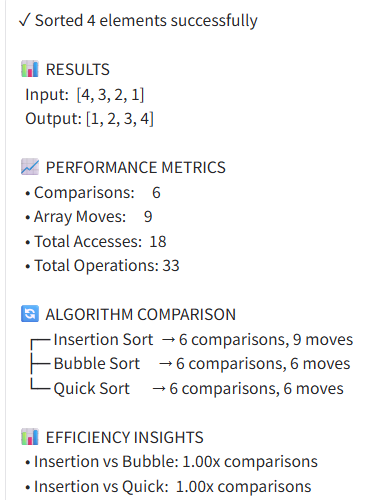


*Figure 7: Reverse sorted performance metrics and comparison*

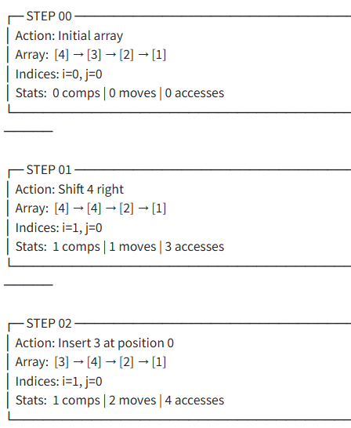


*Figure 8: Initial steps for reverse-sorted input*

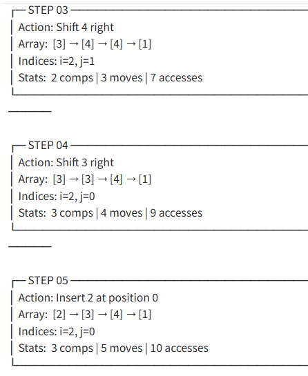


*Figure 9: Middle steps showing multiple shifts*

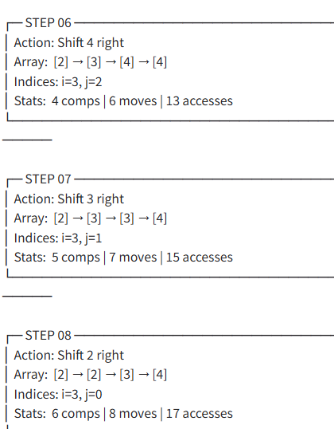


*Figure 10: Final steps reaching sorted state*

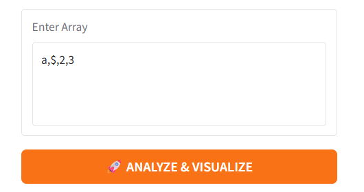


*Figure 11: Input validation - error handling for invalid input*

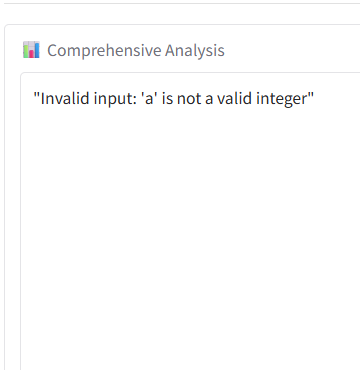


*Figure 12: Analysis view for invalid input case*

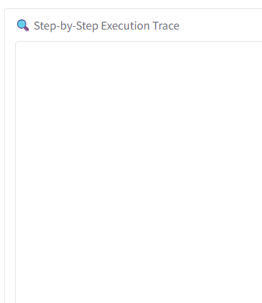


*Figure 13: Step trace not executed due to invalid input*

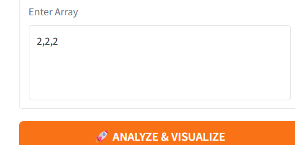


*Figure 8: Duplicate values input demo*

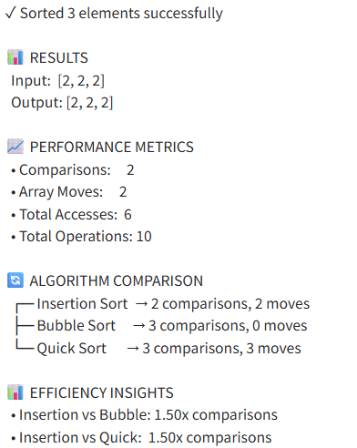


*Figure 15: Duplicate values - stability of insertion sort*


*Figure 16: Initial steps for duplicates case*


---

## Problem Breakdown & Computational Thinking

### Why Insertion Sort?

Insertion sort was chosen because it clearly demonstrates fundamental sorting concepts and shows measurable differences between best, average, and worst-case scenarios. The algorithm is intuitive (similar to sorting playing cards) and provides excellent educational value for understanding algorithmic complexity.

**Key Advantages for Learning:**
- Simple to understand and implement
- Clear visualization of each step
- Observable performance differences based on input order
- Stable sorting (preserves order of equal elements)

### Flowchart

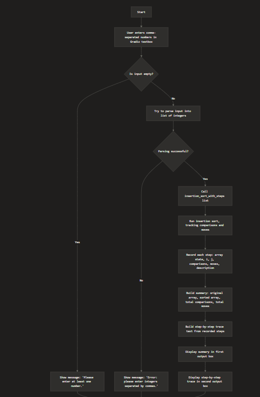


*Figure 14: Application control flow diagram*

The flowchart illustrates the complete algorithm workflow:
1. **Input Validation**: Read and validate user input (comma-separated integers)
2. **Algorithm Execution**: Run insertion sort while tracking metrics
3. **Data Collection**: Record comparisons, moves, and array states
4. **Output Generation**: Display summary, step-by-step trace, and performance analysis
5. **User Interface**: Present results in Gradio UI with multiple output formats

### Decomposition

The problem is broken down into distinct, manageable components:

1. **Input Processing**:
   - Accept comma-separated integer input from user
   - Parse and validate each value
   - Handle errors gracefully (invalid characters, empty input)

2. **Core Algorithm**:
   - Implement insertion sort with tracking capability
   - Record array state after each operation
   - Track performance metrics (comparisons, moves, array accesses)
   - Maintain indices (i, j) for visualization

3. **Algorithm Comparison** (Enhanced Feature):
   - Execute bubble sort and quicksort on same input
   - Compare performance across all three algorithms
   - Calculate efficiency ratios

4. **Output Formatting**:
   - Generate comprehensive summary with metrics
   - Create step-by-step execution trace
   - Build interactive performance dashboard
   - Format data for easy readability

5. **User Interface**:
   - Display results in organized Gradio interface
   - Provide multiple output views (summary, trace, dashboard)
   - Enable interactive input and instant feedback

### Pattern Recognition

**Algorithm Behavior Patterns:**
- **Insertion Process**: Each iteration takes an element (key) and inserts it into its correct position in the sorted portion
- **Comparison Pattern**: Key is compared with elements from right to left in the sorted section
- **Shift Pattern**: Larger elements shift right to make space for the key

**Input Pattern Analysis:**
- **Best Case** (Already Sorted): Minimal comparisons, no moves needed
  - Example: `[1, 2, 3, 4]` → O(n) performance
- **Worst Case** (Reverse Sorted): Maximum comparisons and moves
  - Example: `[4, 3, 2, 1]` → O(n²) performance
- **Average Case** (Random Order): Moderate comparisons and moves
  - Example: `[5, 2, 9, 1]` → O(n²) performance
- **Duplicates**: Algorithm handles gracefully, maintains stability
  - Example: `[3, 3, 3]` → Equal elements remain in original order

**Visualization Patterns:**
- Each step records current array state, allowing users to track progression
- Metrics accumulate progressively, showing effort growth
- Active indices (i, j) highlight which elements are being compared

### Abstraction

**Information Shown to User:**
- High-level algorithm steps in plain English
- Array state at each significant operation
- Current indices (i, j) being processed
- Cumulative performance metrics (comparisons, moves, accesses)
- Algorithm comparison results
- Visual performance dashboard

**Information Hidden from User:**
- Python implementation details (loops, conditionals, variables)
- Internal data structures (dictionaries, lists for tracking)
- Gradio callback mechanisms
- Memory management and array copying

**Abstraction Benefits:**
- Focuses on algorithmic concepts, not code syntax
- Makes learning accessible to beginners
- Emphasizes "what" happens, not "how" it's implemented in Python
- Presents algorithm as a logical process rather than programming code

### Algorithm Design (Input → Processing → Output)

- Input:
  - A single Gradio Textbox labeled “Enter numbers (comma-separated)” where the user provides integers like `5, 2, 9, 1, 5`.
- Processing:
  - `parse_list(text)`:
    - Splits by commas, strips whitespace, converts to `int`, and raises an error for invalid values.
  - `insertion_sort_with_steps(arr)`:
    - Runs insertion sort on a copy of the list.
    - Tracks and updates:
      - `comparisons` each time two values are compared.
      - `moves` each time a value is written into the array.
    - Appends a step record after each shift and each insertion.
  - `run_lab(text)`:
    - Coordinates the process:
      - Validates input.
      - Calls `parse_list` and `insertion_sort_with_steps`.
      - Builds a short summary string and a multi-line step-by-step trace string.
- Output:
  - Summary textbox:
    - Original array.
    - Sorted array.
    - Total comparisons.
    - Total moves.
  - Step-by-step trace textbox:
    - Sequence of steps showing:
      - Array after each operation.
      - Indices `i` and `j`.
      - Comparisons and moves so far.
      - Text description of the operation.
  - This design makes the app function like a teaching “lab” for exploring insertion sort and its time complexity behavior. [attached_file:35][web:6]

---

## Steps to Run

1. Install requirements:
   ```
   pip install -r requirements.txt
   ```

2. Run the app:
   ```
   python app.py
   ```

3. Open the local URL shown in the terminal (for example, `http://127.0.0.1:7860`) in your browser.
4. In the UI:
   - Enter a list of integers such as `5, 2, 9, 1, 5`.
  - Choose whether to enable "Show algorithm comparisons (bubble & quick)" (leave OFF for strict single‑algorithm mode).
  - Press "ANALYZE & VISUALIZE" to see:
     - The comprehensive analysis (original vs sorted array, total comparisons, moves, and accesses).
    - If comparisons are enabled, metrics for bubble sort and quick sort.
     - The full step-by-step trace of insertion sort.
     - Interactive performance dashboard.

### Example Inputs to Try

- `5, 2, 9, 1, 5` (mixed/random order)
- `1, 2, 3, 4` (already sorted / best case)
- `4, 3, 2, 1` (reverse-sorted / worst case)
- `3, 3, 3` (duplicates)
- `7, 2, 8, 1, 5, 3` (medium-sized input)
- `10, 9, 8, 7, 6, 5` (reverse order for comparison)
- Invalid: `a, 2, 3` (shows input error message)

---

## Hugging Face Link

- Live app: https://huggingface.co/spaces/Aurikology/Insertion-Sort-Lab

---

## Author & Acknowledgment

- **Author**: *Aurik*
- **Course**: CISC 121 – Introduction to Computing Science I
- **Acknowledgments**:
  - CISC 121 project guidelines and marking rubric for defining the requirements.
  - Gradio documentation examples for building a simple Python interface.
  - General insertion sort explanations from standard algorithm references (used for conceptual understanding, not for copying code).
  - Advanced features including multi-algorithm comparison and performance analytics developed to enhance educational value.

---

## Project Instructions

This final project focuses on a single algorithm: Insertion Sort. The Gradio UI takes comma-separated integers, runs the algorithm step-by-step, and shows both the final result and each intermediate step. Optional comparison metrics for bubble and quick sort are included only for educational context.

- Exactly One Algorithm: Insertion Sort is the primary algorithm implemented and visualized.
- Simple GUI: Gradio `Textbox` for input, a single `Button` to run, and outputs for summary, step trace, and a dashboard.
- Documentation: README includes decomposition, pattern recognition, abstraction, algorithm design, and a flowchart.
- Clean Code: Well-commented functions, input validation with clear error messages, and edge-case tests evidenced by screenshots.
- Submission: Provide the GitHub repo URL and a Hugging Face Space URL (after deployment). You may also create a public link locally by launching with `share=True`.

AI Use: Within “Open book, at-home. AI use up to Level 4.” No copyrighted code was copied; implementation and explanations are original.

If the marking requires strictly one algorithm, please grade only the insertion sort components; the comparative metrics can be ignored without affecting the core functionality.
---

## UI Usability Notes

- Clear action: Click "Analyze & Visualize" to run the analysis.
- Clear validation: Invalid inputs return readable error messages via Gradio `Error` outputs.
- Accessible visuals: High-contrast text, simplified icons, and consistent font sizes for readability.
- Guided workflow: “Quick Start” examples and step-by-step trace help users understand actions and results.
- Minimal friction: Single input field, one action button, optional comparison toggle (off by default).
